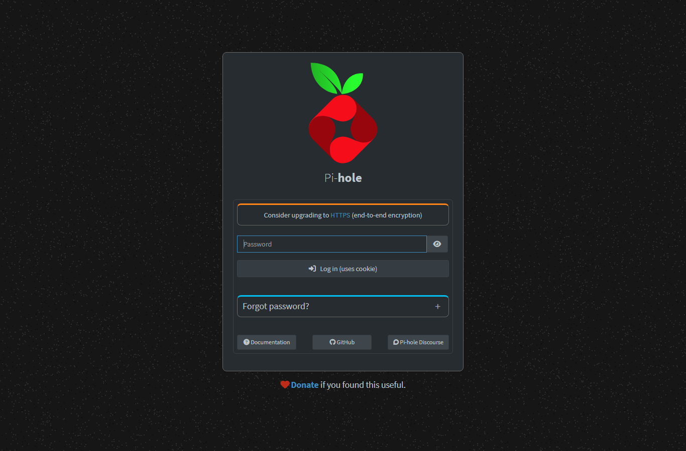

# Bloqueador de anuncios casero con Raspberry Pi + Pi-hole + Tailscale

> Objetivo: dejar de ver anuncios en todos mis dispositivos, estén en la casa (WiFi) o afuera (datos móviles), usando una Raspberry Pi como servidor DNS con Pi-hole y Tailscale como VPN para "llevarme" ese DNS a todos lados.

## 1. ¿Por qué esto y no una app de bloqueo cualquiera?

Las apps de bloqueo de anuncios en el celular normalmente:
- Solo funcionan dentro del navegador (no bloquean anuncios de apps nativas).
- Consumen batería.
- Algunas venden tus datos de navegación (irónico, lo sé).

Un **DNS sinkhole** (Pi-hole) resuelve esto a nivel de red: cuando una app pide la IP de `doubleclick.net`, el Pi-hole responde `0.0.0.0` en vez de la IP real, y la app/anuncio nunca carga. El problema es que esto solo funciona si el dispositivo *usa* el DNS del Pi-hole. En la casa es fácil (se configura en el router). Afuera, con datos móviles, el celular usa el DNS de la operadora... a menos que exista un túnel VPN que lo lleve de vuelta al Pi-hole. Ahí entra **Tailscale**.

## 2. Arquitectura

```
[Celular Android] --(datos móviles o WiFi)--> Internet
        |
        | túnel Tailscale (WireGuard, cifrado)
        v
[Raspberry Pi en la casa] --- corre Pi-hole (puerto 53) + tailscaled
        |
        v
   DNS "de verdad" (1.1.1.1, 8.8.8.8, etc.) solo si el dominio NO está bloqueado
```

Ambos dispositivos (Raspberry y celular) están dentro del mismo *tailnet* (red privada de Tailscale). El celular manda sus consultas DNS a la IP de Tailscale de la Raspberry (`100.x.x.x`), no a su IP de LAN (`192.168.x.x`), así que funciona sin importar en qué red física esté.

## 3. Requisitos

- Raspberry Pi (usé una con Debian 13 "trixie") con SSH habilitado.
- Cuenta de Tailscale (gratis, hasta 100 dispositivos en el plan personal).
- Celular Android.
- Paciencia, porque nada quedó bien a la primera.

## 4. Instalación paso a paso

### 4.1 Instalar Pi-hole en la Raspberry

```bash
curl -sSL https://install.pi-hole.net | bash
```

El instalador es interactivo y preguntó:
- Interfaz de red a usar (`eth0` en mi caso).
- Upstream DNS providers (elegí Cloudflare + Google como respaldo: `1.1.1.1`, `1.0.0.1`, `8.8.8.8`, `8.8.4.4`).
- Listas de bloqueo por defecto.
- Protocolos IPv4/IPv6.

Al final entrega un **panel web** en `http://<ip-local>/admin` y una contraseña temporal para entrar.

### 4.2 Agregar listas de bloqueo más agresivas

Las listas por defecto de Pi-hole bloquean bastante, pero se quedan cortas con trackers modernos. Agregué estas (Configuración → Listas de bloqueo, en el panel web):

```
https://media.githubusercontent.com/media/zachlagden/Pi-hole-Optimized-Blocklists/main/lists/advertising.txt
https://media.githubusercontent.com/media/zachlagden/Pi-hole-Optimized-Blocklists/main/lists/tracking.txt
https://media.githubusercontent.com/media/zachlagden/Pi-hole-Optimized-Blocklists/main/lists/malicious.txt
https://media.githubusercontent.com/media/zachlagden/Pi-hole-Optimized-Blocklists/main/lists/suspicious.txt
https://media.githubusercontent.com/media/zachlagden/Pi-hole-Optimized-Blocklists/main/lists/comprehensive.txt
https://media.githubusercontent.com/media/zachlagden/Pi-hole-Optimized-Blocklists/main/lists/all_domains.txt
```

Después de agregar listas hay que actualizar "gravity" (la base de datos compilada que usa Pi-hole para bloquear):

```bash
pihole -g
```

Terminé con **más de 7 millones de dominios** bloqueados. Sí.

### 4.3 Instalar Tailscale en la Raspberry

```bash
curl -fsSL https://tailscale.com/install.sh | sh
sudo tailscale up
```

`tailscale up` imprime una URL. Hay que abrirla en un navegador (en cualquier dispositivo) y loguearse con la cuenta de Tailscale (yo usé login con GitHub). Una vez aprobado, la Raspberry aparece en el tailnet con una IP tipo `100.x.x.x`.

Verificar que quedó andando:

```bash
tailscale status
```

### 4.4 Instalar Tailscale en el celular

1. Descargar la app **Tailscale** desde Play Store.
2. Iniciar sesión con la misma cuenta/tailnet que la Raspberry.
3. Activar el switch de conexión (queda corriendo como una VPN normal de Android).

### 4.5 Decirle a Tailscale que use el Pi-hole como DNS de todo el tailnet

Esta parte es la que más cuesta entender al principio: instalar Tailscale en ambos dispositivos **no basta**. Por defecto Tailscale solo interconecta los dispositivos, pero no toca la configuración de DNS de nadie.

En la consola de administración (**https://login.tailscale.com/admin/dns**):

1. En **"Nameservers"** agregar la IP de Tailscale de la Raspberry (la `100.x.x.x`, **no** la `192.168.x.x` de la LAN) como *Global nameserver*.
2. Activar la opción **"Override DNS servers"** (o "Override local DNS" según la versión de la consola). Sin esto, cada dispositivo sigue usando el DNS de su propia red cuando no hay conflicto, y en datos móviles eso significa el DNS de la operadora.
3. (Opcional) Activar **MagicDNS** si se quiere acceder a los dispositivos por nombre (`raspberry.tailXXXX.ts.net`) en vez de por IP.

### 4.6 Sumar un tercer dispositivo: laptop con Arch Linux

Una vez que el celular ya funcionaba, agregué mi notebook (HP EliteBook, Arch Linux) al mismo tailnet para que también use el Pi-hole, incluso conectado a otras redes WiFi (ej. universidad, café).

Instalar Tailscale en Arch (está en el repo `extra` de pacman, no hace falta un script externo como en Debian):

```bash
sudo pacman -S tailscale
sudo systemctl enable --now tailscaled
sudo tailscale up --hostname=elitebook-arch
```

El flag `--hostname` es opcional, pero ayuda para que el dispositivo no aparezca en el tailnet con un nombre genérico tipo `archlinux` (que además puede chocar con otros equipos que se llamen igual).

Igual que con la Raspberry, `tailscale up` entrega una URL para aprobar el dispositivo desde el navegador con la cuenta del tailnet.

Verificar que Tailscale realmente está siendo usado como DNS del sistema:

```bash
cat /etc/resolv.conf
# nameserver 100.100.100.100   <- proxy DNS local de Tailscale, reenvía al nameserver global (el Pi-hole)

resolvectl query doubleclick.net
# doubleclick.net: 0.0.0.0   -- link: tailscale0   <- bloqueado correctamente
```

Si `resolvectl status` muestra que el DNS del enlace WiFi sigue siendo el del router (ej. `192.168.100.75` en modo LAN, sin pasar por `tailscale0`) y no aparece Tailscale como "Global" DNS, revisar el paso 4.5 (nameserver global + override en la consola de Tailscale) — es el mismo error que ya se explica más abajo.

## 5. Capturas y datos reales

Panel de acceso de Pi-hole (`/admin/login`), capturado directamente desde la Raspberry de este proyecto:



Estadísticas reales obtenidas desde la API de Pi-hole (`GET /api/stats/summary`) en el momento de escribir esta documentación:

| Métrica | Valor |
|---|---|
| Dominios en la blocklist (gravity) | 3.901.584 |
| Consultas totales (24h) | 8.379 |
| Consultas bloqueadas | 1.256 (≈ 15%) |
| Bloqueadas por regex (safeframe/adtrafficquality) | 23 |
| Bloqueadas por gravity (listas) | 1.233 |
| Clientes activos en la red | 13 |

El 15% de bloqueo parece poco, pero hay que recordar que la mayoría de las consultas DNS totales son de apps normales (WhatsApp, APIs de bancos, CDNs, etc.), no solo anuncios. Lo importante es que ese ~15% son justamente los dominios de tracking/publicidad que antes cargaban sin filtro.

## 6. Verificación

Con WiFi conectado en casa:

```bash
nslookup doubleclick.net
# Debería responder 0.0.0.0
```

Apagando el WiFi del celular y probando solo con datos móviles, abrir una página con anuncios y ver si cargan. Si el Pi-hole está bien configurado, no deberían aparecer (o aparecer muchos menos).

Para confirmar que las consultas realmente están llegando al Pi-hole por Tailscale, se puede revisar el log en vivo desde la Raspberry:

```bash
sudo tail -f /var/log/pihole/pihole.log
```

y buscar líneas con la IP de Tailscale del celular (ej. `100.72.18.99`) mientras se navega con datos móviles.

## 7. Errores que me encontré (y cómo los resolví)

### Error 1: "Funciona en WiFi pero no en datos móviles"
- **Causa:** el Pi-hole nunca se configuró como *Global nameserver* en la consola de Tailscale, o la opción "Override DNS" estaba apagada. El celular, al estar en su red WiFi de casa, usaba el Pi-hole porque el router lo entregaba por DHCP; en datos móviles no había ese DHCP, así que usaba el DNS de la operadora.
- **Solución:** configurar el nameserver global + override en `login.tailscale.com/admin/dns` (paso 4.5). Con esto el celular usa el DNS del tailnet sin importar la red física en la que esté.

### Error 2: Pi-hole no responde a consultas que llegan por la interfaz de Tailscale
- **Causa:** Pi-hole tiene una opción `listeningMode` en `/etc/pihole/pihole.toml` (versión 6). Si queda en `LOCAL`, solo responde a IPs de la subred que reconoce como "local", y puede ignorar silenciosamente las consultas que llegan desde la interfaz `tailscale0` (rango `100.64.0.0/10`).
- **Solución:** cambiar a modo `ALL`:
  ```bash
  sudo pihole-FTL --config dns.listeningMode ALL
  # o editando directamente /etc/pihole/pihole.toml
  ```
  y reiniciar el servicio:
  ```bash
  sudo systemctl restart pihole-FTL
  ```

### Error 3: El celular no aparecía "online" en `tailscale status`
- **Causa:** la app de Tailscale en Android puede quedar "dormida" por el ahorro de batería del sistema, cortando el túnel VPN sin avisar.
- **Solución:** en Ajustes de Android → Batería → Tailscale → permitir que corra sin restricciones ("sin optimización de batería"). También ayuda activar "Ejecutar en segundo plano" dentro de la propia app.

### Error 4: Algunos anuncios seguían apareciendo aunque el DNS y Tailscale estaban bien
- **Causa:** esta fue la más interesante. Comprobé con `dig` que dominios de anuncios "clásicos" (`doubleclick.net`, `googlesyndication.com`, `googletagservices.com`) sí quedaban bloqueados (`0.0.0.0`). Pero Google sirve algunos anuncios desde subdominios **generados al azar**, tipo:
  ```
  daee5707fcfa35345e4d941fbfb1c828.safeframe.googlesyndication.com
  ```
  Como el hash cambia constantemente, **ninguna lista de bloqueo estática puede tener ese dominio exacto**, así que siempre se "escapaba" y se resolvía normal.
- **Solución:** usar una regla de **expresión regular** en Pi-hole en vez de una lista de dominios exactos, para cubrir *cualquier* subdominio:
  ```bash
  pihole --regex "(\.|^)safeframe\.googlesyndication\.com$" "(\.|^)adtrafficquality\.google$"
  ```
  Verificación:
  ```bash
  dig @127.0.0.1 daee5707fcfa35345e4d941fbfb1c828.safeframe.googlesyndication.com +short
  # 0.0.0.0
  ```

### Error 5: `pihole -q dominio` decía "0 domains" aunque el dominio sí estaba bloqueado
- **Causa:** confusión mía. El comando `pihole -q` en Pi-hole v6 busca coincidencias exactas en la tabla de listas manuales (denylist/allowlist), no en toda la base "gravity" compilada (que tenía más de 7 millones de entradas). Que dijera "0 domains" no significaba que no estuviera bloqueado.
- **Solución:** para comprobar bloqueo real, siempre usar una consulta DNS directa en vez de `pihole -q`:
  ```bash
  dig @<ip-del-pihole> dominio.com +short
  ```
  Si devuelve `0.0.0.0` o `::`, está bloqueado. Si devuelve una IP real, no lo está.

### Error 6: El Pi-hole del proyecto y mi PC estaban en *tailnets* distintos
- **Causa:** tenía dos cuentas de Tailscale distintas usadas en distintos dispositivos (una asociada a un correo, otra asociada a una cuenta de GitHub), así que desde un dispositivo no se veían los del otro tailnet. Perdí tiempo pensando que el Pi-hole "no estaba en la VPN" cuando en realidad sí lo estaba, pero en otra red privada.
- **Solución:** confirmar con `tailscale status` en **cada** dispositivo involucrado (no asumir que todos ven la misma lista) y usar la misma cuenta/tailnet en todos los dispositivos que deban compartir el Pi-hole.

### Error 7: `tailscale up` se quedó "pegado" y el link de autenticación dejó de servir
- **Causa:** al configurar el laptop con Arch, ejecuté `tailscale up` y como no terminaba rápido (queda esperando que se apruebe el login en el navegador) até a pensar que se había colgado y lo corrí de nuevo un par de veces. Cada ejecución nueva de `tailscale up` genera **una URL de autenticación distinta**, y deja el proceso anterior corriendo en segundo plano compitiendo por el mismo login. Terminé con 3 procesos `tailscale up` vivos al mismo tiempo y ninguno de los links viejos servía porque el estado había cambiado.
- **Solución:**
  1. Matar todos los procesos viejos antes de reintentar:
     ```bash
     sudo pkill -9 -f "tailscale up"
     ```
  2. Ejecutar `tailscale up` **una sola vez** y usar únicamente el último link que imprime:
     ```bash
     sudo tailscale up --hostname=elitebook-arch
     ```
  3. Si se necesita correrlo sin bloquear la terminal (por ejemplo por SSH), mandarlo a segundo plano con `setsid`/`nohup` y leer el link desde el archivo de log en vez de relanzar el comando:
     ```bash
     sudo bash -c 'setsid nohup tailscale up --hostname=elitebook-arch > /tmp/ts-up.log 2>&1 < /dev/null &'
     sleep 3 && cat /tmp/ts-up.log
     ```

### Error 8: El kernel de Raspberry Pi OS no soporta NAT para IPv6
- **Causa:** al activar `--advertise-exit-node`, Tailscale ofrece automáticamente ruteo de **IPv4 y IPv6** (`0.0.0.0/0` y `::/0`). El laptop tenía como ruta principal justo IPv6 (así entrega direcciones el ISP), así que en cuanto activó el exit node, todo su tráfico se fue por la ruta IPv6 hacia la Raspberry... y ahí murió, porque el kernel de Raspberry Pi OS (`6.18.34+rpt-rpi-v8`) **no tiene compilado el soporte de NAT/masquerade para IPv6** (`CONFIG_IP6_NF_NAT` no existe ni como módulo). Se puede confirmar así:
  ```bash
  grep -i "IP6_NF_NAT\|IP6_NF_TARGET_MASQUERADE" /boot/config-$(uname -r)
  # (sin resultados = no está compilado, no es algo que se arregle con modprobe)

  sudo nft list ruleset | grep -A4 "table ip6 nat"
  # chain ts-postrouting {
  #   ... # Warning: XT target MASQUERADE not found
  #   xt target "MASQUERADE"
  # }
  ```
  El resultado: los paquetes IPv6 se marcaban para NAT pero la regla fallaba silenciosamente, así que esos paquetes nunca volvían — el laptop se quedaba sin internet porque justo su ruta principal era la que estaba rota.
- **Solución:** en vez de anunciar el exit node completo (v4+v6), anunciar solo la ruta IPv4:
  ```bash
  sudo tailscale set --advertise-exit-node=false --advertise-routes=0.0.0.0/0
  ```
  Esto hace que la Raspberry siga ofreciéndose como exit node (aparece igual en `tailscale exit-node list`), pero **solo para IPv4**, que sí tiene NAT funcionando. El costo: el tráfico IPv6 del dispositivo cliente no pasa por el túnel (queda usando su red local directamente). Para este proyecto es un compromiso aceptable; si se necesita protección también en IPv6, la alternativa real es compilar un kernel custom con `CONFIG_IP6_NF_NAT`, algo fuera del alcance de un Raspberry Pi OS estándar.

### Error 9: La Raspberry en realidad ya tenía la puerta de enlace mal configurada (sin relación con Tailscale)
- **Causa:** después de "arreglar" el error anterior, seguía sin haber internet — pero esta vez ni siquiera la propia Raspberry podía salir a internet, no solo el laptop. Diagnostiqué con:
  ```bash
  ip route get 8.8.8.8
  # 8.8.8.8 via 255.255.255.0 dev eth0   <- la "puerta de enlace" es una máscara de subred, no una IP válida
  ```
  Resulta que la conexión de red de la Raspberry (`nmcli connection show "Wired connection 1"`) tenía configurada manualmente `ipv4.gateway: 255.255.255.0` en vez de `192.168.100.1` (el router real). Esto probablemente llevaba así desde que alguien configuró la IP fija de la Raspberry y se equivocó de campo (puso la máscara de subred donde iba el gateway). No se notaba en el día a día porque las consultas DNS del Pi-hole hacia redes locales igual funcionaban, y aparentemente **otra ruta (quizás una previa por DHCP)** venía tapando el problema hasta que el reinicio de `tailscaled` reforzó la config manual y expuso el error real.
- **Solución:**
  ```bash
  sudo nmcli connection modify "Wired connection 1" ipv4.gateway 192.168.100.1
  sudo nmcli connection up "Wired connection 1"
  ```
- **Aprendizaje:** cuando algo "de repente" deja de funcionar en la red después de un cambio, no asumir que el cambio reciente es la única causa — a veces solo destapa un problema que ya estaba ahí. `ip route get <ip>` fue la herramienta clave para detectarlo rápido.

## 8. Bonus: usar la Raspberry como VPN completa (exit node) para WiFi públicos

Bloquear anuncios con DNS está bien, pero no protege el tráfico en sí: en un WiFi público (aeropuerto, café, universidad) cualquiera en la misma red puede intentar espiar el tráfico no cifrado. La solución es convertir la Raspberry en un **exit node** de Tailscale: todo el tráfico de mis otros dispositivos sale primero cifrado (WireGuard) hacia la Raspberry, y desde ahí a internet. El WiFi público solo ve un túnel cifrado, no el contenido real.

### 8.1 Habilitar reenvío de paquetes (IP forwarding) en la Raspberry

```bash
echo 'net.ipv4.ip_forward = 1' | sudo tee -a /etc/sysctl.d/99-tailscale.conf
echo 'net.ipv6.conf.all.forwarding = 1' | sudo tee -a /etc/sysctl.d/99-tailscale.conf
sudo sysctl -p /etc/sysctl.d/99-tailscale.conf
```

### 8.2 Anunciar la Raspberry como exit node

```bash
sudo tailscale set --advertise-exit-node
```

### 8.3 Aprobar el exit node en la consola de administración

Por defecto Tailscale **no deja usar un exit node hasta que un admin lo aprueba** (medida de seguridad, para que un dispositivo cualquiera no pueda ofrecerse como salida de tráfico sin autorización). Hay que ir a:

**https://login.tailscale.com/admin/machines** → buscar la Raspberry → menú `⋯` → *Edit route settings* → activar *Use as exit node*.

Se puede confirmar desde cualquier otro dispositivo del tailnet con:

```bash
tailscale exit-node list
```

### 8.4 Usar el exit node desde los otros dispositivos

- **Linux (laptop):**
  ```bash
  sudo tailscale set --exit-node=raspberry
  ```
- **Android:** abrir la app Tailscale → tocar "Exit node" (o el ícono de escudo) → elegir `raspberry`.

### 8.5 Verificar que realmente está funcionando

La prueba real es comparar la IP pública del exit node contra la IP pública que ve cada dispositivo:

```bash
# En la Raspberry
curl -4 ifconfig.me

# En el dispositivo que usa el exit node (debería salir la MISMA IP)
curl -4 ifconfig.me
```

En el celular, lo más simple es abrir `whatismyip.com` en el navegador y comparar contra la IP de la Raspberry.

> **Nota:** `tailscale status` puede mostrar un warning `Subnet routing is enabled, but IP forwarding is disabled`. Si ya se siguió el paso 8.1 y el exit node funciona (las IPs públicas coinciden), es un falso positivo relacionado con el error de IPv6 explicado en la sección de errores (Error 8) — se puede ignorar con tranquilidad.

## 9. Conclusiones

- Un Pi-hole solo sirve dentro de la red donde vive, a menos que se combine con una VPN tipo Tailscale que "estire" esa red a cualquier lugar.
- El bloqueo por DNS tiene un límite natural: dominios generados dinámicamente (hashes aleatorios) no se pueden bloquear con listas de dominios exactos, hay que usar expresiones regulares.
- La mayoría de los "no funciona" no fueron culpa de Pi-hole ni de Tailscale por separado, sino de la configuración que los conecta (el nameserver global + override DNS de Tailscale).
- Revisar logs en tiempo real (`tail -f /var/log/pihole/pihole.log`) fue la herramienta más útil para depurar, mucho más que adivinar.
- Un exit node de Tailscale convierte la Raspberry en una VPN completa "gratis" (sin pagar un servicio de VPN comercial), pero hay que revisar el soporte de NAT del kernel para IPv6 antes de asumir que "activar el flag ya funciona".
- Antes de asumir que un cambio nuevo (como activar el exit node) rompió algo, vale la pena verificar si el problema ya existía de antes con una herramienta simple como `ip route get <ip>`.

## 10. Recursos usados

- [Documentación oficial de Pi-hole](https://docs.pi-hole.net/)
- [Guía de Tailscale + Pi-hole](https://tailscale.com/kb/1114/pi-hole)
- [Pi-hole Optimized Blocklists (zachlagden)](https://github.com/zachlagden/Pi-hole-Optimized-Blocklists)

## 11. Licencia

Este proyecto (la documentación, no Pi-hole ni Tailscale) se distribuye bajo licencia [MIT](LICENSE).
