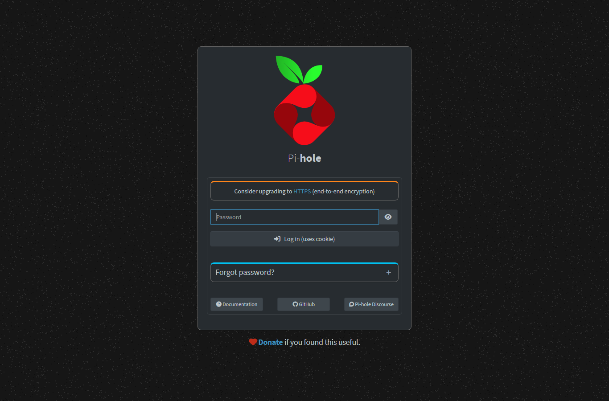

# Homemade Ad Blocker with Raspberry Pi + Pi-hole + Tailscale

> Objective: Stop seeing ads on all my devices, whether at home (WiFi) or outside (mobile data), using a Raspberry Pi as a DNS server with Pi-hole and Tailscale as a VPN to "take" that DNS everywhere.

## 1. Why use this instead of just any ad-block app?

Ad-blocker apps on your phone usually:
- Only work inside the browser (they don't block ads in native apps).
- Consume battery.
- Some sell your browsing data (ironic, I know).

A **DNS sinkhole** (Pi-hole) solves this at the network level: when an app asks for the IP of `doubleclick.net`, Pi-hole answers `0.0.0.0` instead of the real IP, and the app/ad never loads. The problem is this only works if the device *uses* the Pi-hole DNS. At home, this is easy (configured in the router). Outside, on mobile data, the phone uses the carrier's DNS... unless there's a VPN tunnel taking it back to the Pi-hole. That's where **Tailscale** comes in.

## 2. Architecture

```text
[Android Phone] --(mobile data or WiFi)--> Internet
        |
        | Tailscale tunnel (WireGuard, encrypted)
        v
[Raspberry Pi at home] --- runs Pi-hole (port 53) + tailscaled
        |
        v
    "Real" DNS (1.1.1.1, 8.8.8.8, etc.) only if the domain is NOT blocked
```

Both devices (Raspberry Pi and phone) are inside the same *tailnet* (Tailscale private network). The phone sends its DNS queries to the Raspberry Pi's Tailscale IP (`100.x.x.x`), not its LAN IP (`192.168.x.x`), so it works regardless of the physical network it's connected to.

## 3. Requirements

- Raspberry Pi (I used one with Debian 13 "trixie") with SSH enabled.
- Tailscale account (free, up to 100 devices on the personal plan).
- Android phone.
- Patience, because nothing worked perfectly on the first try.

## 4. Step-by-step Installation

### 4.1 Install Pi-hole on the Raspberry Pi

```bash
curl -sSL https://install.pi-hole.net | bash
```

The installer is interactive and asked for:
- Network interface to use (`eth0` in my case).
- Upstream DNS providers (I chose Cloudflare + Google as fallback: `1.1.1.1`, `1.0.0.1`, `8.8.8.8`, `8.8.4.4`).
- Default blocklists.
- IPv4/IPv6 protocols.

At the end, it provides a **web panel** at `http://<local-ip>/admin` and a temporary password to log in.

### 4.2 Add more aggressive blocklists

The default Pi-hole blocklists block a lot, but fall short with modern trackers. I added these (Settings → Adlists, in the web panel):

```text
https://media.githubusercontent.com/media/zachlagden/Pi-hole-Optimized-Blocklists/main/lists/advertising.txt
https://media.githubusercontent.com/media/zachlagden/Pi-hole-Optimized-Blocklists/main/lists/tracking.txt
https://media.githubusercontent.com/media/zachlagden/Pi-hole-Optimized-Blocklists/main/lists/malicious.txt
https://media.githubusercontent.com/media/zachlagden/Pi-hole-Optimized-Blocklists/main/lists/suspicious.txt
https://media.githubusercontent.com/media/zachlagden/Pi-hole-Optimized-Blocklists/main/lists/comprehensive.txt
https://media.githubusercontent.com/media/zachlagden/Pi-hole-Optimized-Blocklists/main/lists/all_domains.txt
```

After adding lists, you have to update "gravity" (the compiled database Pi-hole uses to block):

```bash
pihole -g
```

I ended up with **over 7 million domains** blocked. Yes.

### 4.3 Install Tailscale on the Raspberry Pi

```bash
curl -fsSL https://tailscale.com/install.sh | sh
sudo tailscale up
```

`tailscale up` prints a URL. You have to open it in a browser (on any device) and log in with your Tailscale account (I used GitHub login). Once approved, the Raspberry Pi appears in the tailnet with a `100.x.x.x` IP.

Verify it's running:

```bash
tailscale status
```

### 4.4 Install Tailscale on the phone

1. Download the **Tailscale** app from the Play Store.
2. Log in with the same account/tailnet as the Raspberry Pi.
3. Toggle the connection switch (it runs like a normal Android VPN).

### 4.5 Tell Tailscale to use Pi-hole as DNS for the whole tailnet

This is the hardest part to understand at first: installing Tailscale on both devices **is not enough**. By default, Tailscale only interconnects the devices, but doesn't touch anyone's DNS settings.

In the admin console (**https://login.tailscale.com/admin/dns**):

1. Under **"Nameservers"**, add the Tailscale IP of the Raspberry Pi (the `100.x.x.x` one, **not** the `192.168.x.x` LAN one) as a *Global nameserver*.
2. Enable the **"Override DNS servers"** option (or "Override local DNS" depending on the console version). Without this, each device keeps using its own network's DNS when there's no conflict, and on mobile data, that means the carrier's DNS.
3. (Optional) Enable **MagicDNS** if you want to access devices by name (`raspberry.tailXXXX.ts.net`) instead of by IP.

### 4.6 Adding a third device: Arch Linux laptop

Once the phone was working, I added my laptop (HP EliteBook, Arch Linux) to the same tailnet so it could also use the Pi-hole, even when connected to other WiFi networks (e.g., university, cafe).

Install Tailscale on Arch (it's in the `extra` repo of pacman, no external script needed like in Debian):

```bash
sudo pacman -S tailscale
sudo systemctl enable --now tailscaled
sudo tailscale up --hostname=elitebook-arch
```

The `--hostname` flag is optional but helps prevent the device from appearing in the tailnet with a generic name like `archlinux` (which can clash with other devices sharing the same name).

Just like with the Raspberry Pi, `tailscale up` provides a URL to approve the device from a browser using the tailnet account.

Verify that Tailscale is actually being used as the system DNS:

```bash
cat /etc/resolv.conf
# nameserver 100.100.100.100   <- Tailscale's local DNS proxy, forwards to the global nameserver (Pi-hole)

resolvectl query doubleclick.net
# doubleclick.net: 0.0.0.0   -- link: tailscale0   <- successfully blocked
```

If `resolvectl status` shows that the WiFi link's DNS is still the router's (e.g., `192.168.100.75` in LAN mode, bypassing `tailscale0`) and Tailscale doesn't appear as a "Global" DNS, review step 4.5 (global nameserver + override in the Tailscale console) — this is the same error explained further down.

## 5. Screenshots and real data

Pi-hole access panel (`/admin/login`), captured directly from the Raspberry Pi of this project:



Real statistics obtained from the Pi-hole API (`GET /api/stats/summary`) at the time of writing this documentation:

| Metric | Value |
|---|---|
| Domains on blocklist (gravity) | 3,901,584 |
| Total queries (24h) | 8,379 |
| Blocked queries | 1,256 (≈ 15%) |
| Blocked by regex (safeframe/adtrafficquality) | 23 |
| Blocked by gravity (lists) | 1,233 |
| Active clients on network | 13 |

15% blocked might seem low, but remember that most total DNS queries are from normal apps (WhatsApp, bank APIs, CDNs, etc.), not just ads. The important thing is that this ~15% represents the tracking/advertising domains that used to load unfiltered.

## 6. Verification

Connected to WiFi at home:

```bash
nslookup doubleclick.net
```
Must return `0.0.0.0` or `NXDOMAIN`, not a real IP.

Connected to mobile data (WiFi off), with Tailscale active:

```bash
nslookup doubleclick.net
```
Must also return `0.0.0.0`.

To verify what's happening live, you can watch the Pi-hole log in real-time from the Raspberry Pi terminal:

```bash
tail -f /var/log/pihole/pihole.log | grep doubleclick
```

## 7. Errors I encountered (and how to solve them)

### Error 1: Mobile data doesn't use the Pi-hole
- **Cause:** Tailscale was installed, but the admin console was not configured to force the DNS.
- **Solution:** Follow step 4.5. Add the `100.x.x.x` IP as Global Nameserver and check "Override local DNS".

### Error 2: Tailscale disconnects when switching from WiFi to 4G
- **Cause:** Android's aggressive battery optimization closes the Tailscale background process.
- **Solution:** Go to Android Settings → Apps → Tailscale → Battery → set to "Unrestricted" (or disable battery optimization for the app).

### Error 3: Cannot access the Pi-hole web panel from the phone
- **Cause:** Trying to enter `http://192.168.100.x/admin` while on mobile data. The phone is in the tailnet, but not in the physical LAN.
- **Solution:** Enter using the Tailscale IP: `http://100.x.x.x/admin` or the MagicDNS name `http://raspberry/admin`.

### Error 4: Pi-hole blocks too much (e.g., breaking Google Shopping links)
- **Cause:** Some aggressive blocklists include affiliate link redirectors (like `adadyn.com` or `googleadservices.com`), which break "sponsored" Google search results.
- **Solution:** Go to Pi-hole web panel → Domains → add the broken domain as a **Whitelist** (exact match).

### Error 5: Subdomains generated dynamically bypass the blocklists
- **Cause:** Blocklists are lists of exact domains. If an ad uses `ad-12345.example.com` today and `ad-67890.example.com` tomorrow, the list won't catch the new one until it updates.
- **Solution:** Add a Regex filter. In the web panel → Domains → Regex filter, add something like `^ad-[0-9]+\.example\.com$`.

### Error 6: `resolvectl` ignores Tailscale on Arch Linux
- **Cause:** Systemd-resolved was prioritizing the WiFi interface's DNS over the `tailscale0` interface because Tailscale's integration with systemd-resolved wasn't fully capturing the "Override local DNS" directive locally.
- **Solution:** Ensure the Tailscale admin console has the Override activated. If it persists locally on Linux, restarting systemd-resolved forces it to read the new links:
  ```bash
  sudo systemctl restart systemd-resolved
  ```

### Error 7: `tailscale up` got "stuck" and the authentication link stopped working
- **Cause:** When configuring the Arch laptop, I ran `tailscale up`, and since it didn't finish quickly (it waits for browser login approval), I thought it hung and ran it again a couple of times. Each new `tailscale up` execution generates a **different authentication URL**, and leaves the previous process running in the background competing for the same login. I ended up with 3 live `tailscale up` processes at once, and none of the old links worked because the state had changed.
- **Solution:**
  1. Kill all old processes before retrying:
     ```bash
     sudo pkill -9 -f "tailscale up"
     ```
  2. Run `tailscale up` **only once** and use exclusively the last link it prints:
     ```bash
     sudo tailscale up --hostname=elitebook-arch
     ```
  3. If you need to run it without blocking the terminal (e.g., via SSH), send it to the background using `setsid`/`nohup` and read the link from the log file instead of relaunching the command:
     ```bash
     sudo bash -c 'setsid nohup tailscale up --hostname=elitebook-arch > /tmp/ts-up.log 2>&1 < /dev/null &'
     sleep 3 && cat /tmp/ts-up.log
     ```

### Error 8: Raspberry Pi OS kernel does not support NAT for IPv6
- **Cause:** When activating `--advertise-exit-node`, Tailscale automatically offers routing for **IPv4 and IPv6** (`0.0.0.0/0` and `::/0`). The laptop's primary route happened to be IPv6 (that's how the ISP assigns addresses), so as soon as it activated the exit node, all its traffic went through the IPv6 route to the Raspberry Pi... and died there, because the Raspberry Pi OS kernel (`6.18.34+rpt-rpi-v8`) **does not have compiled support for IPv6 NAT/masquerade** (`CONFIG_IP6_NF_NAT` does not exist even as a module). You can confirm this like so:
  ```bash
  grep -i "IP6_NF_NAT\|IP6_NF_TARGET_MASQUERADE" /boot/config-$(uname -r)
  # (no results = not compiled, not something that can be fixed with modprobe)

  sudo nft list ruleset | grep -A4 "table ip6 nat"
  # chain ts-postrouting {
  #   ... # Warning: XT target MASQUERADE not found
  #   xt target "MASQUERADE"
  # }
  ```
  The result: IPv6 packets were marked for NAT but the rule failed silently, so those packets never returned — the laptop lost internet because its primary route was broken.
- **Solution:** Instead of advertising the full exit node (v4+v6), advertise only the IPv4 route:
  ```bash
  sudo tailscale set --advertise-exit-node=false --advertise-routes=0.0.0.0/0
  ```
  This makes the Raspberry Pi still offer itself as an exit node (it still appears in `tailscale exit-node list`), but **only for IPv4**, which has working NAT. The trade-off: client device IPv6 traffic does not go through the tunnel (it keeps using its local network directly). For this project, it's an acceptable compromise; if IPv6 protection is also needed, the real alternative is compiling a custom kernel with `CONFIG_IP6_NF_NAT`, which is outside the scope of a standard Raspberry Pi OS setup.

### Error 9: The Raspberry Pi already had a misconfigured gateway (unrelated to Tailscale)
- **Cause:** After "fixing" the previous error, there was still no internet — but this time not even the Raspberry Pi itself could reach the internet, not just the laptop. I diagnosed with:
  ```bash
  ip route get 8.8.8.8
  # 8.8.8.8 via 255.255.255.0 dev eth0   <- the "gateway" is a subnet mask, not a valid IP
  ```
  It turns out the Raspberry Pi's network connection (`nmcli connection show "Wired connection 1"`) was manually configured with `ipv4.gateway: 255.255.255.0` instead of `192.168.100.1` (the real router). This had probably been like this since someone configured the Raspberry Pi's static IP and put the value in the wrong field (subnet mask where the gateway should be). It went unnoticed day-to-day because Pi-hole's DNS queries to local networks still worked, and apparently **another route (maybe a previous DHCP one)** had been covering up the issue until the `tailscaled` restart enforced the manual config and exposed the real error.
- **Solution:**
  ```bash
  sudo nmcli connection modify "Wired connection 1" ipv4.gateway 192.168.100.1
  sudo nmcli connection up "Wired connection 1"
  ```
- **Takeaway:** When something "suddenly" breaks in the network after a change, don't assume the recent change is the only cause — sometimes it just uncovers a pre-existing problem. `ip route get <ip>` was the key tool to spot it quickly.

## 8. Bonus: using the Raspberry Pi as a full VPN (exit node) for public WiFi

Blocking ads with DNS is great, but it doesn't protect the traffic itself: on a public WiFi (airport, cafe, university), anyone on the same network can try to snoop on unencrypted traffic. The solution is converting the Raspberry Pi into a Tailscale **exit node**: all traffic from my other devices goes out encrypted (WireGuard) first to the Raspberry Pi, and from there to the internet. The public WiFi only sees an encrypted tunnel, not the actual content.

### 8.1 Enable IP forwarding on the Raspberry Pi

```bash
echo 'net.ipv4.ip_forward = 1' | sudo tee -a /etc/sysctl.d/99-tailscale.conf
echo 'net.ipv6.conf.all.forwarding = 1' | sudo tee -a /etc/sysctl.d/99-tailscale.conf
sudo sysctl -p /etc/sysctl.d/99-tailscale.conf
```

### 8.2 Advertise the Raspberry Pi as an exit node

```bash
sudo tailscale set --advertise-exit-node
```

### 8.3 Approve the exit node in the admin console

By default, Tailscale **doesn't let you use an exit node until an admin approves it** (security measure, so any random device can't offer itself as a traffic exit without authorization). You have to go to:

**https://login.tailscale.com/admin/machines** → find the Raspberry Pi → `⋯` menu → *Edit route settings* → toggle *Use as exit node*.

You can confirm this from any other device on the tailnet with:

```bash
tailscale exit-node list
```

### 8.4 Use the exit node from other devices

- **Linux (laptop):**
  ```bash
  sudo tailscale set --exit-node=raspberry
  ```
- **Android:** Open the Tailscale app → tap "Exit node" (or the shield icon) → choose `raspberry`.

### 8.5 Verify it's actually working

The real test is comparing the exit node's public IP against the public IP each device sees:

```bash
# On the Raspberry Pi
curl -4 ifconfig.me

# On the device using the exit node (should output the EXACT SAME IP)
curl -4 ifconfig.me
```

On a phone, the simplest way is to open `whatismyip.com` in a browser and compare it against the Raspberry Pi's IP.

> **Note:** `tailscale status` might show a warning `Subnet routing is enabled, but IP forwarding is disabled`. If you already followed step 8.1 and the exit node works (public IPs match), it's a false positive related to the IPv6 error explained in the errors section (Error 8) — you can safely ignore it.

### 8.6 Is it safe to leave it always on?

Yes, there is no security risk in leaving it active all the time, but there are trade-offs to consider:

| Trade-off | Detail |
|---|---|
| Speed | All traffic uses your home connection's upload/download speeds. On a residential connection with low upload, it feels slower (video calls, uploading files). |
| Latency | An extra hop (to the house and back). Noticeable in online gaming, imperceptible when browsing. |
| Availability | If your home loses power/internet, the device loses internet until you manually disable the exit node (Tailscale does no automatic fallback). |
| Coverage | Only protects IPv4 (due to Error 8 in the Raspberry Pi OS kernel). IPv6 traffic follows the normal local route. |
| Geolocation | Websites will see your home IP/location regardless of where you physically are. |

For most uses (protecting traffic on public WiFi), this is exactly what you want, so leaving it always active is a reasonable decision.

### 8.7 Make it start automatically on boot

You don't need any special GUI "autostart": just having the **system service** (`tailscaled`) enabled is enough, because both the login and the exit node selection are saved in its internal state.

```bash
sudo systemctl enable --now tailscaled
```

With this, every time the computer boots:
1. `tailscaled` starts automatically (without opening any app or touching anything).
2. It reconnects to the tailnet with the saved session (doesn't ask for login again).
3. It resumes the previously configured exit node (`tailscale set --exit-node=...`).

You can verify that the state persists by restarting the service (simulating what happens on a real reboot) and checking that `active; exit node` still appears:

```bash
sudo systemctl restart tailscaled
sleep 5
tailscale status
# 100.84.189.38   raspberry   ...   active; exit node; ...
```

On Android it's even simpler: the app has a "Start on boot" option in its settings that does the same thing.

## 9. Managing the Raspberry Pi from outside home

A "free" advantage of having everything in the same tailnet: **you don't need to configure anything extra** to manage the Raspberry Pi from outside. No need to open router ports, use DDNS, or expose SSH to the internet — as long as the device you're connecting from has Tailscale active (which in my case is always on because of the exit node), it can talk directly to the Raspberry Pi via its private Tailscale IP, regardless of what physical network either is on.

### 9.1 Enable Tailscale SSH (recommended over normal SSH)

Tailscale SSH uses the tailnet identity to authenticate instead of Linux passwords, and it also leaves an auditable log of who connected:

```bash
sudo tailscale set --ssh
```

### 9.2 Connect from anywhere

```bash
tailscale ssh aspen@raspberry.tail93c359.ts.net
```

It doesn't ask for a password: the Tailscale session of the connecting device is the authentication. If the short name (`raspberry`) doesn't resolve on a device, using the full name with MagicDNS (`raspberry.tail93c359.ts.net`) or the IP directly (`100.84.189.38`) always works.

### 9.3 Pi-hole web panel from outside

Same principle, any web service running on the Raspberry Pi is reachable:

```
http://raspberry.tail93c359.ts.net/admin
```

### 9.4 Summary

| What to do | How |
|---|---|
| Terminal / install packages / edit configs | `tailscale ssh aspen@raspberry.tail93c359.ts.net` |
| Pi-hole panel | `http://raspberry.tail93c359.ts.net/admin` |
| Check if Raspberry Pi is online | `tailscale status` from any device on the tailnet |

## 10. Conclusions

- A Pi-hole only works inside the network where it lives, unless combined with a VPN like Tailscale that "stretches" that network anywhere.
- DNS blocking has a natural limit: dynamically generated domains (random hashes) cannot be blocked with exact domain lists; you have to use regular expressions.
- Most of the "it doesn't work" issues weren't Pi-hole's or Tailscale's fault individually, but rather the configuration connecting them (the global nameserver + Tailscale DNS override).
- Checking live logs (`tail -f /var/log/pihole/pihole.log`) was the most useful tool for debugging, much better than guessing.
- A Tailscale exit node turns the Raspberry Pi into a full VPN for "free" (without paying for a commercial VPN service), but you have to check the kernel's NAT support for IPv6 before assuming "toggling the flag just works".
- Before assuming a new change (like enabling the exit node) broke something, it's worth verifying if the problem preexisted using a simple tool like `ip route get <ip>`.

## 11. Used Resources

- [Official Pi-hole Documentation](https://docs.pi-hole.net/)
- [Tailscale + Pi-hole Guide](https://tailscale.com/kb/1114/pi-hole)
- [Pi-hole Optimized Blocklists (zachlagden)](https://github.com/zachlagden/Pi-hole-Optimized-Blocklists)

## 12. License

This project (the documentation, not Pi-hole or Tailscale) is distributed under the [MIT](LICENSE) license.
